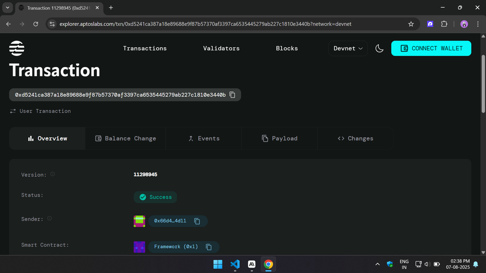

# Dividend Distribution Token

## Project Description

The Dividend Distribution Token is a smart contract built on the Aptos blockchain that implements a comprehensive token system with approval and allowance mechanisms for delegated transfers. This contract enables token holders to authorize third parties (spenders) to transfer tokens on their behalf, providing flexibility for decentralized finance (DeFi) applications, automated trading systems, and dividend distribution mechanisms.

The contract features two core functions: `approve` for setting spending allowances and `transfer_from` for executing delegated transfers, making it compatible with standard token interaction patterns while maintaining security and transparency.

## Project Vision

Our vision is to create a robust and secure dividend distribution system that empowers token holders with flexible transfer mechanisms while maintaining complete control over their assets. We aim to bridge traditional finance concepts with blockchain technology, enabling automated dividend payments, trustless token management, and seamless integration with DeFi protocols.

The project seeks to democratize access to sophisticated financial instruments by providing a simple yet powerful smart contract that can serve as the foundation for various financial applications, from corporate dividend systems to decentralized autonomous organizations (DAOs).

## Key Features

- **Approval Mechanism**: Token holders can approve specific addresses to spend tokens on their behalf up to a predetermined limit
- **Delegated Transfers**: Authorized spenders can transfer tokens from the owner's account to any recipient within approved limits
- **Security Controls**: Built-in checks ensure that transfers cannot exceed approved allowances or available balances
- **Flexible Integration**: Compatible with standard token interaction patterns used across DeFi ecosystems
- **Transparent Operations**: All approvals and transfers are recorded on-chain for complete transparency
- **Gas Efficient**: Optimized code structure minimizes transaction costs for users
- **Dividend Ready**: Foundation structure supports future dividend distribution functionality

## Future Scope

- **Automated Dividend Distribution**: Implement periodic dividend payments based on token holdings
- **Yield Farming Integration**: Add staking mechanisms for token holders to earn additional rewards
- **Multi-Token Support**: Extend functionality to handle multiple token types within a single contract
- **Governance Features**: Integrate voting mechanisms for token holder decision-making
- **Advanced Analytics**: Develop tools for tracking dividend history and token movement patterns
- **Cross-Chain Compatibility**: Explore bridges to other blockchain networks
- **Mobile SDK**: Create mobile development kits for easier integration with wallet applications
- **Compliance Tools**: Add features for regulatory compliance and reporting
- **Insurance Integration**: Partner with DeFi insurance protocols to protect user funds
- **DAO Treasury Management**: Expand capabilities for decentralized treasury operations

## Contract Details
0xd5241ca387a18e89688e9f87b57370af3397ca6535445279ab227c1810e3440b

